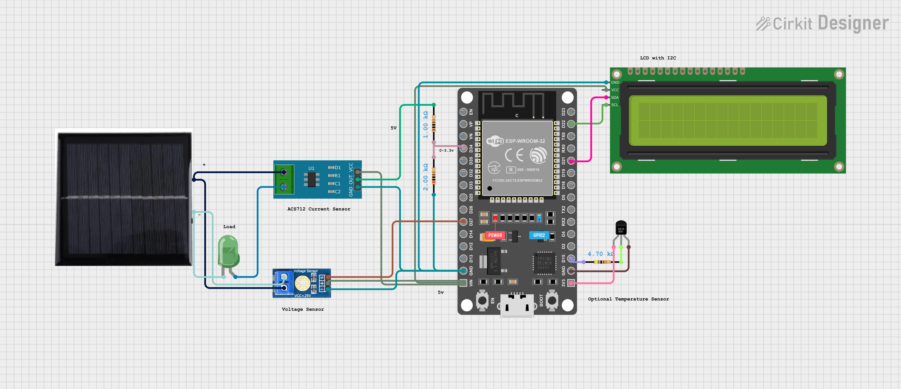

# 🌞 Solar Power Monitor IoT System


An **ESP32-based Solar Energy Monitoring System** that measures **current, power, and daily energy (Wh)** using an ACS712 current sensor, displays real-time values on a **16×2 I2C LCD**, and sends live data to **Blynk Cloud**.

The system automatically **resets daily energy at midnight**, making it suitable for solar performance tracking, IoT learning, and academic mini-projects.

---

## 📌 Features

- Real-time **Current (A)** measurement using ACS712  
- Real-time **Power (W)** calculation  
- **Daily Energy (Wh)** accumulation  
- Automatic **daily reset at midnight**  
- Live monitoring via **Blynk IoT Cloud**  
- Local display using **16×2 I2C LCD**  
- Automatic zero-current calibration at startup  

---

## 🧰 Hardware Requirements

- ESP32 Development Board  
- ACS712 Current Sensor (5A / 20A / 30A)  
- 16×2 I2C LCD Display  
- Solar Panel (or DC source for testing)  
- Voltage Divider (for ACS712 scaling)  
- Jumper Wires  

---

## 📌 Circuit Diagram

The complete circuit diagram for this project is shown below.  
Click the image to open the **interactive design** on Cirkit Designer.

[](https://app.cirkitdesigner.com/project/73204086-9959-4a45-9f8d-5b0c558ae49c)

🔗 **Interactive Circuit Link:**  
https://app.cirkitdesigner.com/project/73204086-9959-4a45-9f8d-5b0c558ae49c

---

## 📡 Software & Libraries

- Arduino IDE  
- ESP32 Board Package  
- Blynk IoT Platform  

### Required Libraries

- `WiFi.h`  
- `BlynkSimpleEsp32.h`  
- `LiquidCrystal_I2C.h`  

---

##  Adjust Panel Voltage

Set your solar panel voltage manually in the code or use voltage sensor as described in the circuit diagram:

```cpp
float panelVoltage = 4.20;

```
---
##  Blynk Dashboard Configuration

| Virtual Pin | Parameter         |
|------------|-------------------|
| V0         | Voltage (V)       |
| V1         | Current (A)       |
| V2         | Power (W)         |
| V3         | Daily Energy (Wh) |

---
## LCD Display Output
```
I: 1.23A
E: 12.45Wh
```
## ⬇️ Downloads & Setup

### 🔧 Arduino IDE

Download and install the Arduino IDE from the official website:

- 🌐 https://www.arduino.cc/en/software

After installation:
- Install **ESP32 Board Package** via Boards Manager  
- Select the correct ESP32 board and COM port  

---

### 📱 Blynk IoT Platform

Create your Blynk dashboard and obtain your **Auth Token** using the official apps:

- 📲 **Android App:** https://play.google.com/store/apps/details?id=cloud.blynk  
- 📲 **iOS App:** https://apps.apple.com/app/blynk-iot/id1559317868  
- 🌐 **Web Console:** https://blynk.cloud/

Steps:
1. Create a new Blynk template  
2. Add widgets using the provided **Virtual Pins (V0–V3)**  
3. Copy the **Blynk Auth Token** and use in the code. 

---

# Solar-Power-Monitor-IOT-system
